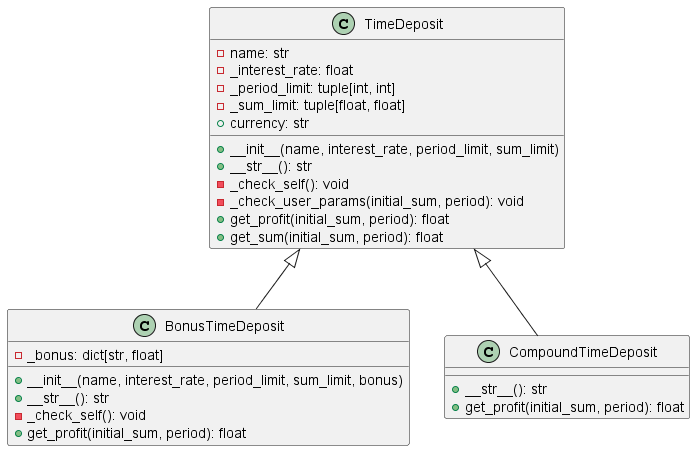

# Лабораторная работа на неделю 4, задание 1
## **Тема**: Объектно-ориентированное программирование на Python 
### Студента группы ПИЖ-б-о-23-1(1) Джабраилова Бекхана Магомедовича <br><br>
**Репозиторий Git:** https://github.com/haneex22/pizh2311_Dzhabrailov  
**Вариант: 7**  
**Практическая работа:**  
*Задание:*  
4.3.3. Банковские вклады
Банк предлагает ряд вкладов для физических лиц:
- Срочный вклад: расчет прибыли осуществляется по формуле простых процентов;
- Бонусный вклад: бонус начисляется в конце периода как % от прибыли, если вклад больше определённой суммы;
- Вклад с капитализацией процентов.
Реализуйте приложение, которое бы позволило подобрать клиенту вклад по заданным параметрам.
При выполнении задания необходимо построить UML-диаграмму классов приложения.

*Ответ:* 

*deposit.py*
```python
class TimeDeposit:
    """Абстрактный класс - срочный вклад.

    https://ru.wikipedia.org/wiki/Срочный_вклад.

    Поля:
      - self.name (str): наименование;
      - self._interest_rate (float): процент по вкладу (0; 100];
      - self._period_limit (tuple (int, int)):
            допустимый срок вклада в месяцах [от; до);
      - self._sum_limit (tuple (float, float)):
            допустимая сумма вклада [от; до).
    Свойства:
      - self.currency (str): знак/наименование валюты.
    Методы:
      - self._check_self(initial_sum, period): проверяет соответствие данных
            ограничениям вклада;
      - self.get_profit(initial_sum, period): возвращает прибыль по вкладу;
      - self.get_sum(initial_sum, period):
            возвращает сумму по окончании вклада.
    """

    def __init__(self, name, interest_rate, period_limit, sum_limit):
        """Инициализировать атрибуты класса."""
        self.name = name
        self._interest_rate = interest_rate
        self._period_limit = period_limit
        self._sum_limit = sum_limit
        self._check_self()

    def __str__(self):
        """Вернуть строкое представление депозита."""
        return (
            f"Наименование:       {self.name}\n"
            f"Валюта:             {self.currency}\n"
            f"Процентная ставка:  {self._interest_rate}\n"
            f"Срок (мес.):        [{self._period_limit[0]}; {self._period_limit[1]})\n"
            f"Сумма:              [{self._sum_limit[0]:,.0f}; {self._sum_limit[1]:,.0f})"
        )

    @property
    def currency(self):
        return "руб."  # Не изменяется

    def _check_self(self):
        """Проверить, что данные депозита являются допустимыми."""
        assert 0 < self._interest_rate <= 100, \
            "Неверно указан процент по вкладу!"
        assert 1 <= self._period_limit[0] < self._period_limit[1], \
            "Неверно указаны ограничения по сроку вклада!"
        assert 0 < self._sum_limit[0] <= self._sum_limit[1], \
            "Неверно указаны ограничения по сумме вклада!"

    def _check_user_params(self, initial_sum, period):
        """Проверить, что данные депозита соответствуют его ограничениям."""
        is_sum_ok = self._sum_limit[0] <= initial_sum < self._sum_limit[1]
        is_period_ok = self._period_limit[0] <= period < self._period_limit[1]
        assert is_sum_ok and is_period_ok, "Условия вклада не соблюдены!"

    def get_profit(self, initial_sum, period):
        """Вернуть прибыль по вкладу вклада клиента.

        Параметры:
          - initial_sum (float): первоначальная сумма;
          - period (int): количество месяцев размещения вклада.

        Формула:
          первоначальная_сумма * % / 100 * период / 12
        """
        # Проверить, укладывается ли вклад в ограничения
        self._check_user_params(initial_sum, period)
        # Выполнить расчет
        return initial_sum * self._interest_rate / 100 * period / 12

    def get_sum(self, initial_sum, period):
        """Вернуть сумму вклада клиента после начисления прибыли.

        Параметры:
          - initial_sum (float): первоначальная сумма;
          - period (int): количество месяцев размещения вклада.
        """
        # Проверить, укладывается ли вклад в ограничения
        return initial_sum + self.get_profit(initial_sum, period)


class BonusTimeDeposit(TimeDeposit):
    """Cрочный вклад c получением бонуса к концу срока вклада.

    Бонус начисляется как % от прибыли, если вклад больше определенной суммы.

    Атрибуты:
      - self._bonus (dict ("percent"=int, "sum"=float)):
        % от прибыли, мин. сумма;
    """

    def __init__(self, name, interest_rate, period_limit, sum_limit, bonus):
        """Инициализировать атрибуты класса."""
        self._bonus = bonus
        super().__init__(name, interest_rate, period_limit, sum_limit)

    def __str__(self):
        """Вернуть строкое представление депозита."""
        base_info = super().__str__()
        return (
            f"{base_info}\n"
            f"Бонус (%):          {self._bonus['percent']}\n"
            f"Бонус (мин. сумма): {self._bonus['sum']:,.0f}"
        )

    def _check_self(self):
        """Проверить, что данные депозита являются допустимыми."""
        super()._check_self()
        assert isinstance(self._bonus, dict), "Бонус должен быть словарем"
        assert "percent" in self._bonus and "sum" in self._bonus, "Неверно указаны параметры бонуса"
        assert 0 < self._bonus["percent"] <= 100, "Неверно указан процент бонуса"
        assert 0 < self._bonus["sum"], "Неверно указана минимальная сумма для бонуса"

    def get_profit(self, initial_sum, period):
        """Вернуть прибыль по вкладу вклада клиента."""
        base_profit = super().get_profit(initial_sum, period)
        if initial_sum >= self._bonus["sum"]:
            bonus = base_profit * self._bonus["percent"] / 100
            return base_profit + bonus
        return base_profit


class CompoundTimeDeposit(TimeDeposit):
    """Cрочный вклад c ежемесячной капитализацией процентов."""

    def __str__(self):
        """Вернуть строкое представление депозита."""
        base_info = super().__str__()
        return f"{base_info}\nКапитализация %   : Да"

    def get_profit(self, initial_sum, period):
        """Вернуть прибыль по вкладу вклада клиента."""
        self._check_user_params(initial_sum, period)
        return initial_sum * (1 + self._interest_rate / 100 / 12) ** period - initial_sum


# ---

deposits_data = dict(interest_rate=5, period_limit=(6, 18), sum_limit=(1000, 100000))

# Список имеющихся депозитов
deposits = (
    TimeDeposit("Сохраняй", interest_rate=5, period_limit=(6, 18), sum_limit=(1000, 100000)),
    BonusTimeDeposit("Бонусный", **deposits_data, bonus=dict(percent=5, sum=2000)),
    CompoundTimeDeposit("С капитализацией", **deposits_data),
    TimeDeposit("Премиальный", interest_rate=7, period_limit=(12, 24), sum_limit=(50000, 500000)),
    BonusTimeDeposit("Бонусный Плюс", interest_rate=6, period_limit=(12, 36), sum_limit=(5000, 200000), bonus=dict(percent=10, sum=50000))
)
```  
*main.py*
```python
from deposit import deposits

if __name__ == "__main__":
    print("Добро пожаловать в систему подбора вкладов!")

    while True:
        print("\n-----")
        print("Нажмите 1, чтобы подобрать вклад, или что угодно для выхода.")

        answer = input()
        if answer == "1":

            initial_sum = float(input("1/2: Введите начальную сумму вклада: "))
            period = int(input("2/2: Введите срок вклада (мес.): "))

            matched_deposits = []
            for deposit in deposits:
                try:
                    deposit._check_user_params(initial_sum, period)
                    matched_deposits.append(deposit)
                except AssertionError as err:
                    pass

            if len(matched_deposits) > 0:
                print("{0:18} | {1:13} | {2:13}".format(
                    "Вклад", "Прибыль", "Итоговая сумма"
                ))
                for deposit in matched_deposits:
                    print("{0:18} | {1:8,.2f} {3:4} | {2:8,.2f} {3:4}".format(
                          deposit.name,
                          deposit.get_profit(initial_sum, period),
                          deposit.get_sum(initial_sum, period),
                          deposit.currency))
            else:
                print("К сожалению, нет подходящих Вам вкладов.")

        else:
            break

    print("\nСпасибо, что воспользовались терминалом банка! До встречи!")

# -------------
# Пример вывода (файл):
#
# Добро пожаловать в систему подбора вкладов!
#
# -----
# Нажмите 1, чтобы подобрать вклад, или что угодно для выхода.
# 1
# 1/2: Введите начальную сумму вклада: 1000
# 2/2: Введите срок вклада (мес.): 12
# Вклад              | Прибыль       | Итоговая сумма
# Сохраняй           |    50.00 руб. | 1,050.00 руб.
# Бонусный           |    50.00 руб. | 1,050.00 руб.
# С капитализацией   |    51.16 руб. | 1,051.16 руб.

```


*Вывод программы:*  
-----
Нажмите 1, чтобы подобрать вклад, или что угодно для выхода.    <br>
1   <br>
1/2: Введите начальную сумму вклада: 1000   <br>
2/2: Введите срок вклада (мес.): 12     <br>
Вклад              | Прибыль       | Итоговая сумма     <br>
Сохраняй           |    50.00 руб. | 1,050.00 руб.      <br>
Бонусный 2         |    50.00 руб. | 1,050.00 руб.      <br>
С капитализацией   |    51.16 руб. | 1,051.16 руб.      <br>  


**UML Диаграмма классов:**  


