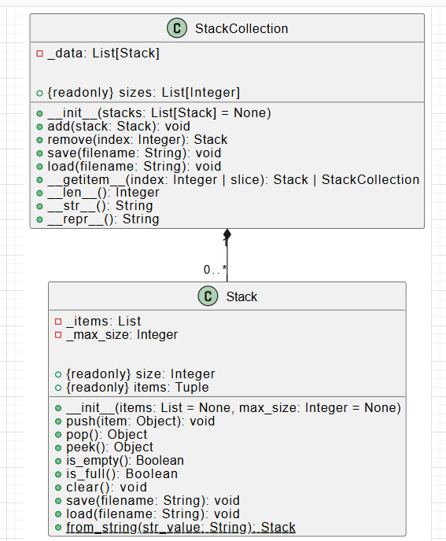

# Лабораторная работа на неделю 5
## **Тема**: Объектно-ориентированное программирование на Python 
### Студента группы ПИЖ-б-о-23-1(1) Джабраилов Бекхан Магомедович <br><br>
**Репозиторий Git:** https://github.com/haneex22/pizh2311_Dzhabrailov  
**Вариант: 7**  
**Практическая работа:**  

*Задание 5:*  

Создайте класс-контейнер, который будет содержать набор объектов из предыдущей задачи. Например, класс VectorCollection будет содержать объекты класса Vector.  
Для класса-контейнера предусмотрите:  
· специальные методы:  

1) __ init __(self, ... ) - инициализация с необходимыми параметрами;  
2) __ str __(self) - представление объекта в удобном для человека виде;  
3) __ getitem __() - индексация и срез для класса-контейнера.  

· поля, методы, свойства:  

1) поле _data - содержит набор данных;  
2) метод add(self, value) - добавляет элемент value в контейнер;  
3) метод remove(self, index) - удаляет элемент из контейнера по индексу index;  
4) метод save(self, filename) - сохраняет объект в JSON-файл filename;
5) метод load(self, filename) - загружает объект из JSON-файла filename.

При выполнении задания необходимо построить UML-диаграмму классов приложения.  

*Ответ:*  
Код файла StackCollection.py:  
```python
import json
from stack import Stack

class StackCollection:
    def __init__(self, stacks=None):
        """
        Инициализация коллекции стеков
        :param stacks: начальный список стеков (по умолчанию None - пустая коллекция)
        """
        self._data = list(stacks) if stacks is not None else []

    def __str__(self):
        """Человекочитаемое представление коллекции"""
        return f"StackCollection({[str(stack) for stack in self._data]})"

    def __getitem__(self, index):
        """Доступ к элементам по индексу или срезу"""
        if isinstance(index, slice):
            return StackCollection(self._data[index])
        return self._data[index]

    def __len__(self):
        """Количество стеков в коллекции"""
        return len(self._data)

    def add(self, stack):
        """Добавляет стек в коллекцию"""
        if not isinstance(stack, Stack):
            raise TypeError("Можно добавлять только объекты класса Stack")
        self._data.append(stack)

    def remove(self, index):
        """Удаляет стек из коллекции по индексу"""
        if index < 0 or index >= len(self._data):
            raise IndexError("Индекс за пределами коллекции")
        return self._data.pop(index)

    def save(self, filename):
        """Сохраняет коллекцию в JSON-файл"""
        data = {
            "stacks": [{"items": stack.items, "max_size": stack._max_size} 
                    for stack in self._data]
        }
        with open(filename, 'w') as f:
            json.dump(data, f)

    def load(self, filename):
        """Загружает коллекцию из JSON-файла"""
        with open(filename, 'r') as f:
            data = json.load(f)
        self._data = [Stack(items=stack_data["items"], 
                        max_size=stack_data["max_size"]) 
                    for stack_data in data["stacks"]]

    @property
    def sizes(self):
        """Возвращает размеры всех стеков в коллекции"""
        return [stack.size for stack in self._data]
```  
Код файла main.py:  
```python
from stack import Stack
from StackCollection import StackCollection

if __name__ == "__main__":
    
    # Создание стеков
    s1 = Stack([1, 2, 3], max_size=5)
    s2 = Stack([4, 5, 6], max_size=10)
    s3 = Stack(["a", "b", "c"])
    
    # Создание коллекции
    collection = StackCollection([s1, s2])
    print(f"Создана коллекция: {collection}")
    
    # Добавление стека
    collection.add(s3)
    print(f"После добавления стека: {collection}")
    
    # Доступ по индексу
    print(f"Первый стек в коллекции: {collection[0]}")
    
    # Срез
    print(f"Срез коллекции: {collection[1:]}")
    
    # Удаление стека
    removed = collection.remove(1)
    print(f"Удален стек: {removed}")
    print(f"Коллекция после удаления: {collection}")
    
    # Сохранение и загрузка
    collection.save("stacks.json")
    new_collection = StackCollection()
    new_collection.load("stacks.json")
    print(f"Загруженная коллекция: {new_collection}")
    
    # Свойство sizes
    print(f"Размеры стеков в коллекции: {new_collection.sizes}")

```  
Вывод программы:  
Создана коллекция: StackCollection(['Stack([1, 2, 3], max_size=5)', 'Stack([4, 5, 6], max_size=10)'])
После добавления стека: StackCollection(['Stack([1, 2, 3], max_size=5)', 'Stack([4, 5, 6], max_size=10)', "Stack(['a', 'b', 'c'], max_size=None)"])
Первый стек в коллекции: Stack([1, 2, 3], max_size=5)
Срез коллекции: StackCollection(['Stack([4, 5, 6], max_size=10)', "Stack(['a', 'b', 'c'], max_size=None)"])
Удален стек: Stack([4, 5, 6], max_size=10)
Коллекция после удаления: StackCollection(['Stack([1, 2, 3], max_size=5)', "Stack(['a', 'b', 'c'], max_size=None)"])
Загруженная коллекция: StackCollection(['Stack([1, 2, 3], max_size=5)', "Stack(['a', 'b', 'c'], max_size=None)"])
Размеры стеков в коллекции: [3, 3]  

UML-диаграмма классов:  
  
