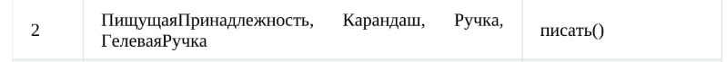
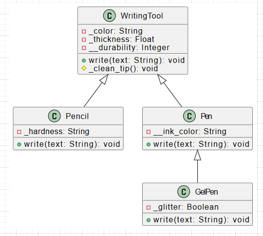

# Лабораторная работа на неделю 5
## **Тема**: Объектно-ориентированное программирование на Python 
### Студента группы ПИЖ-б-о-23-1(1) Джабраилов Бекхан Магомедович <br><br>
**Репозиторий Git:** https://github.com/haneex22/pizh2311_Dzhabrailov  
**Вариант: 7**  
**Практическая работа:**  

*Задание 6:*  
Выберите вариант:  
  
Далее:  
· выстройте классы в иерархию, продумайте их общие и отличительные характеристики и действия;  
· добавьте собственную реализацию методов базового класса в каждый из классов, предусмотрев:

1) необходимые параметры для базовых методов (например, в метод воспроизведения в Dvd-плеере можно передать абстрактный DVD-диск);  
2) необходимые поля для функционирования базовых методов(например, при остановке Dvd-плеера имеет смысл сохранить текущую позицию воспроизведения); классы должны содержать как минимум по одному общедоступному, не общедоступному и закрытому полю/методу;  
3) вывод на экран работы метода (например, вызов метода остановки в Dvd-плеере должен сообщать на экране, что плеер установлен на определенной позиции).  

· по желанию добавьте собственные методы в классы иерархии.  
Реализуйте все классы в отдельном модуле, а также создайте main.py, который бы тестировал все его возможности.  
По согласованию иерархия может быть расширена или выбрана самостоятельная индивидуальная тема для данной задачи.  
При выполнении задания необходимо построить UML-диаграмма классов приложения.  

*Ответ:*  
Код файла writing_tools.py:  
```python
class WritingTool:
    """Базовый класс для пишущих принадлежностей."""
    
    def __init__(self, color: str, thickness: float):
        self._color = color          # Цвет инструмента (защищённое поле)
        self._thickness = thickness  # Толщина линии (защищённое поле)
        self.__durability = 100      # Степень износа (приватное поле)

    def write(self, text: str) -> None:
        """Метод для написания текста."""
        print(f"Пишем: '{text}' | Цвет: {self._color}, Толщина: {self._thickness} мм")
        self._clean_tip()

    def _clean_tip(self) -> None:
        """Защищённый метод для очистки стержня."""
        print("Стержень очищен (базовый метод)")

    def __str__(self):
        return f"Инструмент: цвет={self._color}, толщина={self._thickness}"


class Pencil(WritingTool):
    """Класс карандаша."""
    
    def __init__(self, color: str, thickness: float, hardness: str):
        super().__init__(color, thickness)
        self._hardness = hardness  # Твёрдость грифеля (защищённое поле)

    def write(self, text: str) -> None:
        """Переопределённый метод для карандаша."""
        print(f"(Карандаш) Рисуем: '{text}' | Твёрдость: {self._hardness}")
        super()._clean_tip()


class Pen(WritingTool):
    """Класс ручки."""
    
    def __init__(self, color: str, thickness: float, ink_color: str):
        super().__init__(color, thickness)
        self.__ink_color = ink_color  # Цвет чернил (приватное поле)

    def write(self, text: str) -> None:
        """Переопределённый метод для ручки."""
        print(f"(Ручка) Пишем: '{text}' | Чернила: {self.__ink_color}")


class GelPen(Pen):
    """Класс гелевой ручки."""
    
    def __init__(self, color: str, thickness: float, ink_color: str, glitter: bool):
        super().__init__(color, thickness, ink_color)
        self._glitter = glitter  # Наличие блёсток (защищённое поле)

    def write(self, text: str) -> None:
        """Переопределённый метод для гелевой ручки."""
        if self._glitter:
            print(f"(Гелевая ручка) Блестящий текст: '{text}' ")
        else:
            super().write(text)

```
Код файла main.py:  
```python
from writing_tools import *

if __name__ == "__main__":
    # Создаём экземпляры
    pencil = Pencil("серый", 0.5, "2B")
    pen = Pen("синяя", 0.7, "чёрные")
    gel_pen = GelPen("розовая", 1.0, "золото", True)

    # Тестируем карандаш
    print(pencil)
    pencil.write("Привет, мир!")

    # Тестируем ручку
    print(pen)
    pen.write("Привет, ООП!")

    # Тестируем гелевую ручку
    print(gel_pen)
    gel_pen.write("Это пишет гелевая ручка!")

```
Вывод программы:  

Инструмент: цвет=серый, толщина=0.5
(Карандаш) Рисуем: 'Привет, мир!' | Твёрдость: 2B
Стержень очищен (базовый метод)
Инструмент: цвет=синяя, толщина=0.7
(Ручка) Пишем: 'Привет, ООП!' | Чернила: чёрные
Инструмент: цвет=розовая, толщина=1.0
(Гелевая ручка) Блестящий текст: 'Это пишет гелевая ручка!'  

UML-диаграмма классов:  
  
