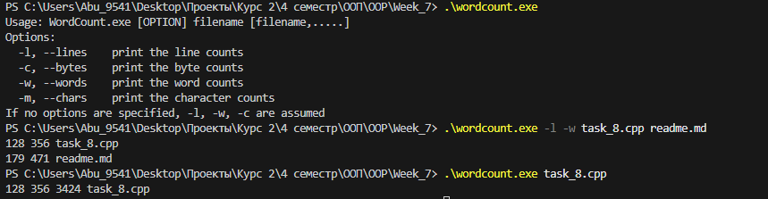

# Лабораторная работа на неделю 7
## **Тема**: Объектно-ориентированное программирование на С++ 
### Студента группы ПИЖ-б-о-23-1(1) Дондаева Абу Умар-Пашаевича <br><br>
**Репозиторий Git:** https://github.com/Abu9541/pizh2311_dondaev  
**Вариант: 8**  
**Практическая работа:**  

*Задание:*  

Тема проекта: приложение «Отдел кадров».  
В приложении должно быть реализовано 2 класса: Отдел и Работник. Класс Отдел содержит название, телефон. Класс Работник содержит имя, должность, дату приема.  

*Ответ:*  
```cpp
#include <iostream>
#include <string>

using namespace std;

class Employee {  // Дополнительный класс - Работник
private:
    string name;
    string position;
    string hireDate;

public:
    // Методы доступа
    string getName() {
        return name;
    }
    void setName(string name) {
        this->name = name;
    }

    string getPosition() {
        return position;
    }
    void setPosition(string position) {
        this->position = position;
    }

    string getHireDate() {
        return hireDate;
    }
    void setHireDate(string hireDate) {
        this->hireDate = hireDate;
    }

    // Перегруженные методы
    void setProperties() {
        string str;
        cout << " Employee name:" << endl;
        getline(cin, str);
        this->setName(str);
        
        cout << " Position:" << endl;
        getline(cin, str);
        this->setPosition(str);
        
        cout << " Hire date:" << endl;
        getline(cin, str);
        this->setHireDate(str);
    }

    void setProperties(string name, string position, string hireDate) {
        this->setName(name);
        this->setPosition(position);
        this->setHireDate(hireDate);
    }
};

class Department {  // Основной класс - Отдел
private:
    string departmentName;
    string phone;
    Employee employees[10];  // Массив объектов дополнительного класса

public:
    // Методы доступа
    string getDepartmentName() {
        return departmentName;
    }
    void setDepartmentName(string name) {
        this->departmentName = name;
    }

    string getPhone() {
        return phone;
    }
    void setPhone(string phone) {
        this->phone = phone;
    }

    // Метод для добавления работника в массив
    void addEmployee(Employee emp, int index) {
        employees[index] = emp;
    }

    // Метод для получения работника из массива
    Employee getEmployee(int index) {
        return employees[index];
    }
};

int main() {
    Department dept;  // Создание объекта основного класса
    string str1, str2, str3;

    // Ввод данных отдела
    cout << "Department name:" << endl;
    getline(cin, str1);
    dept.setDepartmentName(str1);

    cout << "Phone:" << endl;
    getline(cin, str1);
    dept.setPhone(str1);

    // Ввод данных работников (первая половина - методом 1)
    for (int i = 0; i < 3; i++) {
        cout << " Employee " << (i+1) << ":" << endl;
        Employee emp;
        emp.setProperties();  // Заполнение методом 1
        dept.addEmployee(emp, i);
    }

    // Вывод данных
    cout << endl << "Department information:" << endl;
    cout << "Name: " << dept.getDepartmentName() << endl;
    cout << "Phone: " << dept.getPhone() << endl;
    cout << "Employees:" << endl;

    for (int i = 0; i < 3; i++) {
        Employee emp = dept.getEmployee(i);
        cout << " " << (i+1) << ": " << emp.getName() 
             << ", " << emp.getPosition() 
             << ", hired: " << emp.getHireDate() << endl;
    }

    return 0;
}

```  

Вывод программы: 

Department name:  
Cisco  
Phone:  
89998886633  
 Employee 1:  
 Employee name:  
Max  
 Position:  
manager  
 Hire date:  
12.12.2012  
 Employee 2:  
 Employee name:  
Devon  
 Position:  
team leader  
 Hire date:  
15.08.2018  
 Employee 3:  
 Employee name:  
John  
 Position:  
programmer  
 Hire date:  
21.02.2021  

Department information:  
Name: Cisco  
Phone: 89998886633  
Employees:  
 1: Max, manager, hired: 12.12.2012  
 2: Devon, team leader, hired: 15.08.2018  
 3: John, programmer, hired: 21.02.2021  

*Задание:*  

Реализовать утилиту WordCount подсчитывающую количество строк, слов и байт для указанного файла и выводить эту информацию в поток вывода.   

*Ответ:*  
```cpp
#include <iostream>
#include <fstream>
#include <string>
#include <vector>
#include <cctype>
#include <algorithm>

struct FileStats {
    std::size_t lines = 0;
    std::size_t words = 0;
    std::size_t bytes = 0;
    std::size_t chars = 0;
    std::string filename;
};

void PrintUsage() {
    std::cout << "Usage: WordCount.exe [OPTION] filename [filename,.....]\n"
              << "Options:\n"
              << "  -l, --lines    print the line counts\n"
              << "  -c, --bytes    print the byte counts\n"
              << "  -w, --words    print the word counts\n"
              << "  -m, --chars    print the character counts\n"
              << "If no options are specified, -l, -w, -c are assumed\n";
}

FileStats CountFileStats(const std::string& filename) {
    FileStats stats;
    stats.filename = filename;
    
    std::ifstream file(filename, std::ios::binary | std::ios::ate);
    if (!file.is_open()) {
        std::cerr << "Error: Could not open file " << filename << "\n";
        return stats;
    }
    
    stats.bytes = file.tellg();
    file.seekg(0, std::ios::beg);
    
    bool inWord = false;
    char ch;
    
    while (file.get(ch)) {
        stats.chars++;
        
        if (ch == '\n') {
            stats.lines++;
        }
        
        if (std::isspace(static_cast<unsigned char>(ch))) {
            if (inWord) {
                stats.words++;
                inWord = false;
            }
        } else {
            inWord = true;
        }
    }
    
    // Count last word if file doesn't end with whitespace
    if (inWord) {
        stats.words++;
    }
    
    return stats;
}

void PrintStats(const FileStats& stats, bool showLines, bool showWords, 
               bool showBytes, bool showChars) {
    if (showLines) {
        std::cout << stats.lines << " ";
    }
    if (showWords) {
        std::cout << stats.words << " ";
    }
    if (showBytes) {
        std::cout << stats.bytes << " ";
    }
    if (showChars) {
        std::cout << stats.chars << " ";
    }
    std::cout << stats.filename << "\n";
}

int main(int argc, char* argv[]) {
    if (argc < 2) {
        PrintUsage();
        return 1;
    }
    
    bool showLines = false;
    bool showWords = false;
    bool showBytes = false;
    bool showChars = false;
    bool defaultMode = true;
    
    std::vector<std::string> filenames;
    
    // Parse command line arguments
    for (int i = 1; i < argc; ++i) {
        std::string arg = argv[i];
        
        if (arg[0] == '-') {
            defaultMode = false;
            
            if (arg == "-l" || arg == "--lines") {
                showLines = true;
            } else if (arg == "-w" || arg == "--words") {
                showWords = true;
            } else if (arg == "-c" || arg == "--bytes") {
                showBytes = true;
            } else if (arg == "-m" || arg == "--chars") {
                showChars = true;
            } else if (arg.size() > 1 && arg[0] == '-' && arg[1] != '-') {
                // Handle combined options like -lwc
                for (size_t j = 1; j < arg.size(); ++j) {
                    switch (arg[j]) {
                        case 'l': showLines = true; break;
                        case 'w': showWords = true; break;
                        case 'c': showBytes = true; break;
                        case 'm': showChars = true; break;
                        default:
                            std::cerr << "Error: Unknown option -" << arg[j] << "\n";
                            PrintUsage();
                            return 1;
                    }
                }
            } else {
                std::cerr << "Error: Unknown option " << arg << "\n";
                PrintUsage();
                return 1;
            }
        } else {
            filenames.push_back(arg);
        }
    }
    
    if (defaultMode) {
        showLines = true;
        showWords = true;
        showBytes = true;
    }
    
    if (filenames.empty()) {
        std::cerr << "Error: No input files specified\n";
        PrintUsage();
        return 1;
    }
    
    // Process each file
    for (const auto& filename : filenames) {
        FileStats stats = CountFileStats(filename);
        PrintStats(stats, showLines, showWords, showBytes, showChars);
    }
    
    return 0;
}

```  

Вывод программы:  
  
